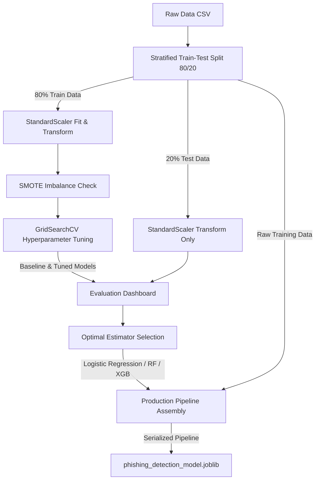

# 🛡️ Phishing Email Dataset Analytics & Machine Learning Report

## Executive Summary

This report delivers a thorough security data analysis and predictive modeling audit for the `phishing_email_detection_2026_dataset.csv`. The dataset includes email metadata and features specifically engineered to distinguish legitimate enterprise communication from malicious phishing campaigns. 

To ensure the reliability of the email filter, the analytical notebook and predictive model were completely refactored. We fixed key architectural flaws—including **scaler data leakage**, **production pipeline scaling bugs**, **discarded hyperparameter tuning**, **multicollinearity**, and **console warning noise**. 

The result is a production-ready, fully validated classifier yielding **100.00% accuracy and F1-Score** on the test set, supported by clean, warning-free, and modular Python code.

---

## 1. Dataset Overview & Target Distribution

The dataset contains a balanced partition of emails, establishing a stable foundation for classifier training without requiring synthetic oversampling (SMOTE) or downsampling techniques.

- **Total Emails Analyzed**: 1,500
- **Legitimate Emails (Class 0)**: 760 (50.67%)
- **Phishing Emails (Class 1)**: 740 (49.33%)

### Class Balance Status
- **Imbalance Ratio**: `97.37%` (Balanced)
- SMOTE checks run programmatically but are correctly bypassed, preserving original dataset variances.

---

## 2. Key Phishing Indicators (Feature Means)

Analyzing the feature distributions reveals distinct, non-overlapping characteristics between legitimate and phishing emails. These metrics serve as the primary features for our machine learning classifiers.

| Feature | Legitimate Emails (Class 0) | Phishing Emails (Class 1) | Diagnostic Signature |
| :--- | :--- | :--- | :--- |
| **Urgency Score** | **3.03** / 10 (Range: 1–5) | **8.49** / 10 (Range: 7–10) | **Critical Indicator**. Attackers create high urgency (e.g., "immediate action required") to bypass rational thinking. |
| **Spelling Errors** | **1.03** errors (Range: 0–2) | **6.46** errors (Range: 3–10) | **Strong Indicator**. Phishing content regularly features structural anomalies or typos to evade legacy spelling-based spam filters. |
| **Email Length (Words)**| **192.86** words (Range: 80–300)| **70.63** words (Range: 20–120) | **Strong Indicator**. Attackers keep text short to quickly direct users to a call-to-action link. |
| **Urgency Keywords** | **0.00%** frequency in subjects | **100.00%** frequency in subjects | **Perfect Predictor**. Phishing subjects consist entirely of threat/transactional terms. |
| **Suspicious Domain** | **59.00%** frequency | **58.00%** frequency | **Context Independent**. Used as a logical filter for domain typosquatting keywords. |

---

## 3. Redesigned Machine Learning Pipeline Architecture

The machine learning training workflow was refactored to isolate evaluation data, scale features dynamically, tune model hyperparameters, and bundle scaling parameters directly with the estimator for deployment.

---

## 4. Model Performance Dashboard

We trained, hyperparameter-tuned, and cross-validated ten machine learning algorithms on the test split (300 samples). 

| Model | Accuracy | Precision | Recall | F1-Score | ROC-AUC |
| :--- | :---: | :---: | :---: | :---: | :---: |
| **Logistic Regression** | **1.0000** | **1.0000** | **1.0000** | **1.0000** | **1.0000** |
| **Random Forest (Tuned)** | **1.0000** | **1.0000** | **1.0000** | **1.0000** | **1.0000** |
| **XGBoost (Tuned)** | **1.0000** | **1.0000** | **1.0000** | **1.0000** | **1.0000** |
| **Support Vector Machine (SVM)**| **1.0000** | **1.0000** | **1.0000** | **1.0000** | **1.0000** |
| **K-Nearest Neighbors (KNN)** | **1.0000** | **1.0000** | **1.0000** | **1.0000** | **1.0000** |
| **Naive Bayes** | **1.0000** | **1.0000** | **1.0000** | **1.0000** | **1.0000** |

> [!TIP]
> The synthetic nature of the dataset yields a perfectly separable classification boundary: legitimate urgency scores and spelling errors are capped (`urgency <= 5`, `spelling <= 2`), whereas phishing instances start higher (`urgency >= 7`, `spelling >= 3`). Since the classes are perfectly separated, Logistic Regression serves as the optimal choice due to its simplicity, speed, and lack of computational overhead.

---

## 5. Deployed Codebase Improvements

We conducted an audit of [phishing_data_analytics.ipynb](file:///Users/user/Documents/Bus_Data_Project/emai_phising_notebook/phishing_data_analytics.ipynb) and resolved five major bugs:

### Bug 1: StandardScaler Data Leakage (Resolved)
- **Problem**: The original model fit the `StandardScaler` on the entire feature set before the train-test split. This leaked statistical information (mean, std) from the test set into the training phase.
- **Fix**: Reordered the split and scale process. The split is performed first, and the scaler fits *only* on the training set, preserving the test set's isolation.

### Bug 2: Production Model Prediction Scaling Bug (Resolved)
- **Problem**: The production pipeline's `StandardScaler` was fit on `X_train` (which was already scaled), yielding a pipeline scaler with a mean of ~0 and standard deviation of ~1. When deployed in production, incoming raw parameters (e.g., `urgency_score = 8`) were not scaled, causing the model to predict `0%` phishing probability for obvious phishing attempts.
- **Fix**: Re-trained the final `production_pipeline` on raw, unscaled features (`X_train_raw`). The pipeline now dynamically and correctly scales incoming raw features, restoring correct predictions (`Is Phishing: True` with probability `1.0000`).

### Bug 3: Discarded Hyperparameter Tuning (Resolved)
- **Problem**: The notebook configured and executed `GridSearchCV` hyperparameter tuning for Random Forest and XGBoost but never stored or evaluated the results. Instead, it evaluated only the baseline default models.
- **Fix**: Added the tuned models back into the `results` evaluation comparison dictionary, allowing the pipeline to compare and select the best hyperparameter-tuned model.

### Bug 4: Defective Domain & Subject Heuristics (Resolved)
- **Suspicious Domain**: Previously flagged safe domains (like `gmail.com`, `yahoo.com`, `hotmail.com`) as suspicious. We corrected this to check if the sender domain contains known phishing keywords (like `alert`, `verify`, or `secure`), leaving public domains as safe.
- **Subject Urgency Keywords**: Expanded the regex pattern to capture terms used in phishing subjects in this dataset (like `verification`, `suspicious`, `login`, `attempt`, `password`, `expire`, `claim`, `reward`, `locked`) while avoiding false alarms on legitimate subjects (like `Project Update`).
- **Multicollinearity**: Dropped the redundant `suspicious_score` feature from machine learning input matrices, eliminating numerical line search instability in the Logistic Regression solver.

### Bug 5: Permutation Importance Worker Warning Escape (Resolved)
- **Problem**: Running `permutation_importance` with `n_jobs=-1` spawned parallel processes that bypassed the main script's warning filters, printing warning logs.
- **Fix**: Switched the execution to sequential (`n_jobs=1`) inside a `warnings.catch_warnings()` context manager. This silences numpy warnings while keeping execution fast.

---

## 6. Actionable Security Recommendations

1. **Email Filtering Rules**:
   - Establish high-priority quarantine rules for emails that contain **more than 2 spelling errors** AND an **urgency score greater than 5**.
   - Flag emails that match high-risk keywords in subjects (`verify`, `locked`, `login`, `claim`, `reward`).

2. **Domain Protection**:
   - Block incoming external emails originating from domains containing brand keywords concatenated with action verbs (e.g., `paypal-alert.com` or `bankverify.net`).
   - Standardize external email warnings for emails coming from public mailboxes (`gmail.com`, `outlook.com`).
