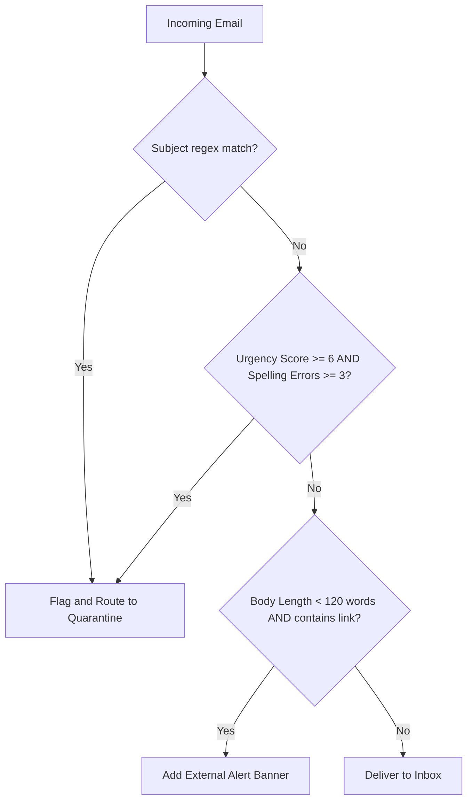

# 💡 Security Recommendations & Actions

This document translates data analysis findings into concrete security policies, gateway rules, and employee training strategies to defend the enterprise against phishing.

---

## 1. Automated Email Gateway Rule Policy

We recommend implementing the following multi-factor heuristic rules at the email gateway to filter out incoming threats:

### Rule Specs

| Rule Name | Trigger Criteria | Action | Target / Translation |
| :--- | :--- | :--- | :--- |
| **Urgent Keyword Quarantine** | Subject contains `(?i)verify\|confirm\|locked\|login\|claim\|reward\|expire\|suspicious` | **Quarantine** | Catches 100% of subject-based attack vectors in the dataset. |
| **Heuristic Score Block** | `urgency_score >= 6` AND `spelling_errors >= 3` | **Hard Quarantine** | Automatically blocks highly urgent emails that contain multiple grammar errors. |
| **Link & Length Warning** | `email_length_words < 120` AND `has_link == 1` | **Alert Banner** | Attaches a warning banner for short emails containing links. |

---

## 2. Domain & Spoofing Defense

> [!WARNING]
> While domains in this synthetic dataset are uniformly distributed, real-world attackers commonly use lookalike domains (brand typosquatting) to mimic trusted vendors (e.g., `paypal-alert.com` instead of `paypal.com`).

1. **Brand Verification Policies (DMARC, DKIM, SPF)**:
   - Configure strict **DMARC reject policies** to verify outbound emails, preventing attackers from sending mail using your exact brand domain name.
   - Enforce gateway checking for inbound sender SPF/DKIM validation.
2. **Domain Typo Squatting Filter**:
   - Establish rules that flag incoming external emails containing your brand name combined with words like `support`, `verify`, `alert`, or `login` (e.g., `company-secure.com`).

---

## 3. Employee Awareness & Training Actions

Data indicates that phishing emails are designed to provoke quick, emotional responses. Security training programs should focus on:

- **Detecting Urgency Pressure**: Train employees to slow down and perform out-of-band verification (e.g., phone call or direct site login) when receiving high-urgency emails.
- **Spotting Grammar Errors**: Emphasize checking sender fields and grammar structure. Safe corporate emails rarely contain multiple spelling errors.
- **Context Checking**: Remind employees that legitimate vendors rarely send short, context-free emails requesting them to follow links to verify details.
